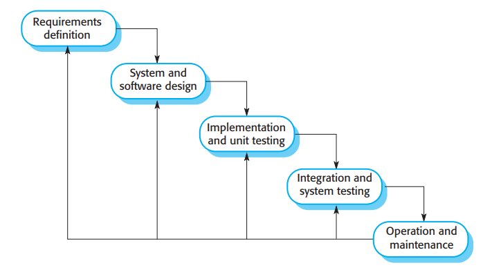

# 2.1.1 瀑布模型

<figure><figcaption>
图 2.1 瀑布模型
</figcaption></figure>

第一个发表的软件开发过程模型是从大型军事系统工程的过程模型衍生出的（Royce，1970）。它用一系列阶段来展现软件的开发过程，如图2.1所示。因为阶段间的连续关系，这个模型以瀑布模型，或是软件生命周期著称。瀑布模型是一个计划驱动的过程例子。原则上你至少在软件开发前需要计划并安排所有的过程活动。

瀑布模型的阶段直接反映了软件开发活动的基础：

1. 需求分析与定义（equirements analysis and definition）系统的服务、约束和目标采用询问系统用户的方式建立。它们随后会被详细定义并作为系统的定义。
2. 系统设计与软件设计（System and software design）系统设计过程分配软件系统或硬件系统的需求；建立一个系统的总体架构。软件设计包括识别并描述软件系统的基本抽象和他们的关系。
3. 软件实现与单元测试（Implementation and unit testing）在这个阶段软件设计以程序或者程序单元的形式实现出来。单元测试涉及到验证每个单元都符合它的定义。
4. 集成与系统测试（Integration and system testing）独立的系统单元或程序被集成在一起，作为一个完整的系统测试来保证需求全部被满足。测试之后，软件系统会被交付给消费者。
5. 运营与维护（Operation and maintenance）一般来说，这是最长的生命周期阶段。整个系统被部署并投入实用。维护涉及到纠正在之前生命周期未发现的错误、改进系统单元的实现、以及为新发现的需求来增强系统的服务。

原则上，瀑布模型每个阶段的结果是一或多个被通过的文件。后续的阶段直到前驱的阶段完成前不会开始。对于硬件的开发来说，因为需要大量生产的费用，这个方法很管用。但是对于软件开发，这些阶段互相重叠，互相提供信息。在设计当中，需求的问题会被识别出来；在编程当中，设计的问题会被发现等等。软件过程在实践中永不会是一个单纯的线性模型，而且还包括了阶段间互相的反馈。

在一个过程阶段中出现新信息时，在前一阶段产生的文档需要修改以反映出系统修改需要。举例说明，如果发现某个需求的实现成本过高无法实现，需求文档的文件需要修改，去掉这个需求。然而这个需要获得用户的同意并且延迟整体的开发进度。

结果，消费者与开发者会过早冻结软件定义，防止它有更多变化。不幸的是这意味着问题会被留到下个解决方案来决定忽略它或是关注它。过早冻结软件需求意味着系统可能不能满足用户需求。也可能导致系统过于结构化，因为设计问题可以通过实现方面的技巧避免。

在最终的生命周期阶段（运营与维护），软件被投入使用。原来软件需求的错误和理由也会被发现。显现出编程和设计问题，并且会识别出新功能的需求。因此系统必须演化来重拾可用性。做出这些改变（软件维护）可能会涉及到重复先前的过程阶段。

在现实中，软件必须灵活，能适应发展中出现的变化。早期的任务和变化发生时对系统的返工意味着瀑布模型只适合一些类型的系统：

1. 嵌入式系统：在此类系统中软件需要与硬件交互。因为硬件的不可改变性，在实现中是不能等待软件功能的决策的。
2. 关键类型系统：此类系统存在广泛对于安全和对于软件定义与涉及的安全分析需求。在此，软件定义和设计文件必须完成之后才能开始分析。在定义和实现阶段的安全系统问题，在后续实现阶段中修改会导致成本很高。
3. 由多个合作公司开发的大型软件系统的一部分：在此类系统中的硬件可能会用类似的模型开发，因为公司们发现使用统一的软硬件模型更为高效。更进一步，当涉及到多个公司时，其他不同的子系统开发会需要完整的软件定义来开发。

瀑布模型不适合系统需求快速变化、以及允许随意团队交流的系统开发。对于这种系统迭代式开发和敏捷方法更为适合。

瀑布模型一个重要的变式是形式化系统开发（formal system development），在这个流程中会创建一个系统定义的数学模型。模型会使用数学变换来进行重新定义而不失一致性地转化为可执行代码。形式化开发过程，比如基于B方法的过程（Abrial 2005, 2010），大多用于有严格安全可靠性需求的情况。这个方法能直接向系统的消费者或是管理者演示系统实际满足了安全性的需要。然而，因为开发形式化软件定义的成本很高，这个开发模型一般仅用在关键系统工程之中。
