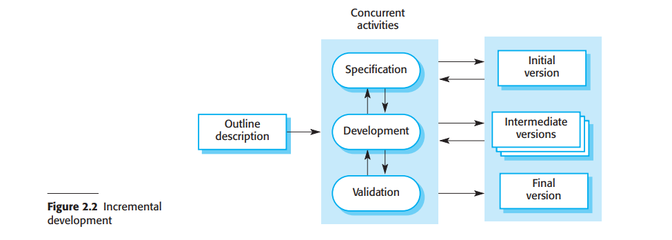

# 2.1.2 增量开发

增量开发是基于开发一个早期的实现，再从用户等方获取回馈，将软件演化出几个版本直到开发出所需系统的思想（图2.2）。在这里软件定义和开发与验证活动相互重叠而不独立存在，这些活动之间存在快速的信息反馈。

<figure><figcaption>
图2.2 增量开发
</figcaption></figure>

增量开发在某种意义上是最常见的应用系统和软件产品开发方式。这个方式既可以使用计划驱动方法，也可以使用敏捷方法或是多种方法的结合。在计划驱动方法中，系统的增量是提前确定的，如果采用敏捷方法的话，早期的增量可以确定，但是后期的增量开发取决于进度和消费者预期。

增量软件开发是敏捷软件开发的一个基本步骤，在系统需求可能在开发过程中改变的情况比瀑布模型更为适合。这也是大多数业务系统和软件产品面对的情况。增量开发也反映了我们解决难题的方式。我们很少能提前给出一个完美解决方案，但是可以通过一步步接近答案，并且在发现错误时返回来纠正。通过逐渐增量地开发软件，我们在开发时对软件进行改变的成本和难度大大降低了。

系统的每次增量或者版本会并入用户的部分需求的功能。一般来说早期的系统增量包括了最重要或是最迫切需要的功能。这意味着用户或消费者在开发的相对早期就可以评估系统是否满足了自己的需求。如果没有的话，只有目前的增量需要修改，或者可能在下个增量中定义新的功能。

增量开发相比瀑布模型有三个主要优势：

1. 减少实现需求的成本。需要重写的分析和文档数量显著少于瀑布模型。
2. 用户更容易获得已完成部分的反馈。用户可以对于软件演示进行评论，了解软件实现到什么程度。相比之下用户很难从软件设计文档中判断进度。
3. 可以更早交付并给用户部署可用的软件，哪怕并没有添加所有功能。用户可以比使用瀑布模型时更早使用软件并从中获得价值。

从管理的方面来看，增量开发的方式有两个问题：

1. 过程是不可监视的。管理者需要定期的交付成果来估计进度。如果系统过快开发的话，对于系统的每个版本编写文档的性价比就不高。
2. 在新的增量被添加的之后，系统的结构会劣化。定期的改变会导致糟糕的代码，因为新的功能在添加时会不择手段。给系统添加新功能会越来越难。为了减少结构劣化和总体代码的复杂度，敏捷方法建议定期重构（refactor）软件。

增量开发的问题在大型、复杂、使用期长的系统中尤为严重，在此不同的团队会开发系统的不同部分。大型的系统需要一个稳定的框架或是体系架构，不同的团队开发的部分和责任需要明确确定，并且遵循架构本身。这必须预先决定，而不是在开发中逐渐确定。

增量开发不意味着你必须把每个增量都交付给客户。你可以逐渐开发完一个系统，再给它展示给客户和股东来评价，不必交付并在用户环境内部署。增量交付（2.3.2章）意味着软件是在实际使用过程中使用，所以用户的反馈更有现实意义。然而给予反馈不是一直可行的，实验新软件可能会打断正常的商业进程。
