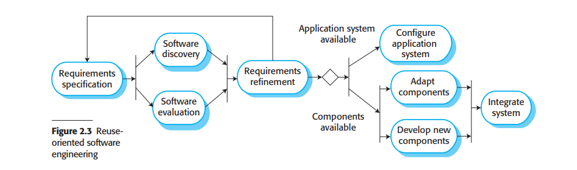

# 2.1.3 集成与设置

在大多数软件项目中都存在软件复用。这经常发生在项目开发者非正式地了解或者搜索到了与需求接近的代码。他们寻找代码，修改他们满足需要，然后将代码集成到已经开发的代码之中。

这种不正式的复用与使用的软件开发过程无关。然而从2000年开始，聚焦于复用的现存软件的软件开发过程已经被广泛使用。面向复用（Reuse-oriented）的方法依赖于可复用的软件组件和可以集成这些组件的框架。

有三种系统组件最为常用：

1. 在特定环境中使用的单机应用系统。这些系统是有很多特性的通用系统，但是他们为适配特殊环境而修改。
2. 作为组件或是组件框架内的软件包开发的对象集合，比如Java Spring框架（Wheeler and White 2013）。
3. 根据服务协议开发的网络服务，可用于远程网络调用。

<figure><figcaption>
图 2.3 面向复用的软件工程
</figcaption></figure>

图2.3展现了基于复用开发的基本过程模型，以集成和设置为基础。在这个软件过程中的阶段有：

1. 需求定义（Requirements specification）：提出系统的首要需求。它们不需要十分详细，但是需要包含对于必要需求和期望系统特性的简要描述。
2. 软件发现与评估（Software discovery and evaluation）：给出软件需求的大纲，搜索能提供需求功能的组件和系统。候选的组件和系统会经历评估确认它们是否满足必要需求以及是否完全适合在系统中投入使用。
3. 需求精化（Requirements refinement）：在这个阶段中，需求会使用已发现的重用组件和应用的信息进行精炼。需求会被修改以反映出可用的组件，系统定义也会被重新定义。在无法改动的地方，可以重启组件分析活动来寻找代替解决方案。
4. 设置应用系统（Application system configuration）：如果有现成的可用系统满足需求，可以将它直接设置用来创建新系统。
5. 组件适配与集成（Component adaptation and integration）：如果没有现成系统，可以修改独立的重用组件并开发新的组件，最后集成在一起创建新系统。

面向复用的软件工程基于设置与集成，显然有着减少开发软件工作量的优势，因此可以减少成本和风险。它也常常能使得软件更快交付。然而，妥协需求不可避免，这可能使得系统不能满足用户的真正需求。此外，由于重用组件的新版本不在使用它们的组织控制下，在系统演化时会失控。

软件复用非常重要，因此第三章中的几个章节我分散到了本书的第三部分关于此话题的内容。软件复用的一般问题在15章，基于组件的软件过程在16、17章，面向服务的系统在18章。
