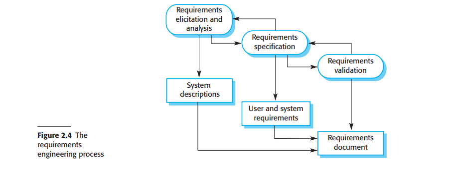

# 2.2.1 软件说明

软件说明（Software Specification）或需求工程（ requirements engineering）是理解并定义系统需求的服务，识别系统运行和开发时的约束的活动。需求工程是软件过程的一个关键阶段，因为这个阶段中的错误必然会带来后续系统设计和实现的问题。

在需求工程开始前，公司可能会实行可行性研究或是市场调研，来确认是否存在软件的需求或市场；以及是否有技术上和资金上实现需求软件的可行性。可行性研究是短期的、相对便宜获得结果的研究，做出是否要继续深入分析的决定。

需求工程过程（图2.4）目标是产出一个受各方接受的需求文档，定义满足股东的系统。需求一般用两个级别的细节程度来表示。

<figure><figcaption>
图2.4 需求工程过程
</figcaption></figure>

需求工程过程有三个主要活动：

1. 需求识别与分析（Requirements elicitation and analysis）：这个过程包括了观察现有系统来扩展系统需求、与潜在用户和采购商的讨论、任务分析等过程。这可能会包括一个或多个系统模型和原型的开发。它们会帮助你理解要定义的系统。
2. 需求说明（Requirements specification）：将在需求分析阶段收集的信息转化为定义需求的文档。文件里可能会包含两种需求。用户需求是对于消费者和最终用户需求的抽象描述。系统需求是对于系统提供的功能的更为细节的说明。
3. 需求验证（Requirements validation）：这个活动检查这些需求是否真实、一致且完备。在这个阶段、需求文档中的错误必须被检查出来。文档接下来需要修改来改正这些问题。

需求分析会在软件定义和说明部分持续，新的需求会在整个过程中不断出现。因此软件分析、定义和说明活动是互相交错的。

在敏捷方法中需求说明不是一个单独的活动，而是系统开发的一部分。需求不是正式指定的，因为每个增量系统都是紧接着上一个系统版本开发的。需求是根据用户的优先级来决定的。需求的启发来源于开发团队内的用户，或是与开发团队联系密切的用户。
