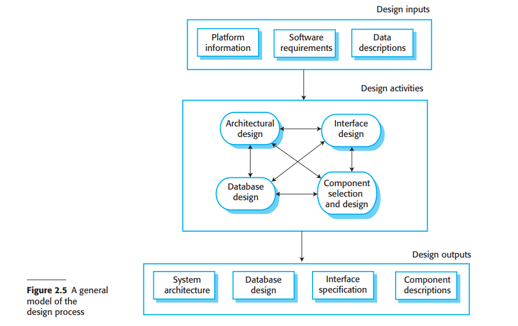

# 2.2.2 软件设计与实现

软件开发的实现阶段是开发交付给用户的可执行系统的过程。有时它包括了单独的软件设计和编程获得。不过，如果开发采用了敏捷方法，设计和实现会互相重叠，并且过程中不会产出设计文档。当然软件是经过设计出来的，但是设计是随意记录在白板上或是程序员的笔记里。

软件设计是对于正在实现的软件结构的解释，包括系统使用的数据模型和结构、系统组件间的接口、有时还会涉及到使用的算法。设计者不会直接完成一个完善的设计，而是会分阶段来进行设计。他们会在设计进行中添加细节，也会回退去修改以前的设计。

<figure><figcaption>
图 2.5 设计过程的一般模型
</figcaption></figure>

图2.5是一个设计过程的抽象模型，展示了设计过程的输入、过程活动和过程输出。设计过程活动间既是交错的，也是相互独立的。关于设计的新信息是即刻生成的，它们会影响先前做出的设计抉择。因此设计返工在所难免。

大多数软件都会与其他软件系统相连。这些其他系统包括操作系统、数据库、中间件或是其他应用系统。他们组成了所谓“软件平台（software platform）”，即软件执行时的所在环境。关于平台的信息是设计过程的必要输入，因为设计者必须决定怎样把它集成进环境最为合适。如果系统需要处理现有的数据，这些数据的描述可以包含在平台说明当中。否则数据描述必须输入设计过程来保证能够定义系统数据组织。

在设计过程中的活动不固定，取决于开发的系统类别。比如实时操作系统需要额外的阶段来设计时序，但是它可能不包括数据库，所以不存在数据库设计。图2.5展示了四种可作为信息系统设计过程的活动：

1. 架构设计（Architectural design）：识别系统的总体架构、首要组件（或称为子系统（subsystem）/模块（module））以及它们的关系，如何分配。
2. 数据库设计（Database design）：设计系统的数据结构，以及它们在数据库里的表示方式。此外，这个工作取决于是否要复用现有数据库或是创建新数据库。
3. 接口设计（Interface design）：定义系统组件间的接口。接口的说明不能模糊。有准确的接口才能保证组件在不了解其他组件的实现的同时完成开发。只要接口说明通过，组件就可以单独设计并开发。
4. 组件选择和设计（Component selection and design）：寻找可复用的组件，如果没有合适的可用组件，就设计新的软件组件。在这个阶段的设计可以只是一个简单的组件描述，实现细节留给程序员负责。取而代之的是，它可能是一系列的对于复用组件的修改，或是使用UML的详细设计模型。这个设计模型可以直接用于自动生成一个实现。

这些活动最终会到达设计输出的结果，如图2.5所示。对于关键系统，设计过程的输出是详细的设计文档，它给出了精确合适的系统描述。如果使用模型驱动方法（第五章），设计的输出会是设计图表。如果开发方法采用敏捷方法，设计过程的输出可能不是单独的说明文档而是使用程序代码的方式。

系统设计的后面自然是实现系统的软件开发。尽管某些类型的程序，比如安全关键系统常常是完全在开发前完成了很详细的设计；但是一般来说，程序开发和设计是互相交错进行的。软件开发工具可用来从设计中生成骨架程序（skeleton program）。它包括了定义与实现接口的程序，多数情况开发者只需要往里添加每个组件操作的细节。

<figure><figcaption>
图2.6 测试的不同阶段
</figcaption></figure>

编程是每个人独立的活动，也没有普遍遵守的流程。有些程序员会从他们理解的组件开始开发，然后转向相对不那么理解的组件。另外一些会使用相反的方法，最后开发熟悉的组件，因为自己已经足够熟悉。有些开发者喜欢在早期定义数据，然后用其加速开发；其他人则会尽量拖延识别数据。

正常来说，程序员会对自己开发出的代码进行测试。这常常会找到程序中需要去除的缺陷（bugs）。找出并修复系统缺陷被称为调试（debugging）。缺陷测试和调试是不同的过程。测试确立了缺陷的存在。调试包括了定位和纠正缺陷。

当你在调试时，你必须从程序的行为中建立假设，并且测试这些假设，期待发现造成程序异常的原因。测试这些假设会包括手动追踪程序代码。也可能会需要新的测试用例来定位问题。交互式调试工具可以显示程序变量的中间值并追踪语句的执行，常常用于辅助调试过程。
