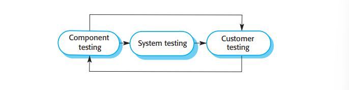
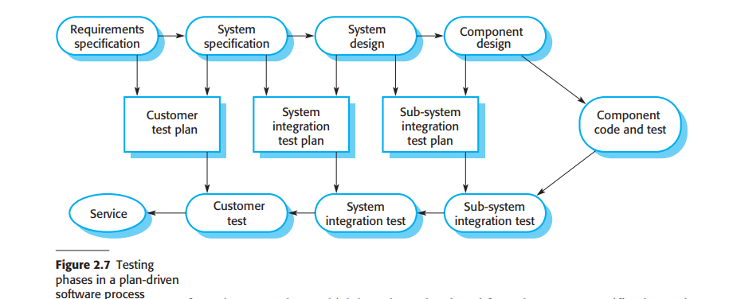

# 2.2.3 软件确认

软件确认，或者一般来说，确认与验证（verification and validation,V\&V）的目的是展示一个系统既与它的说明一致，也能满足系统消费者的需要。程序测试中系统会用模拟的测试数据运行，是最主要的确认方法。确认也可能包括了进度检查，比如检查和评审，位于从用户需求定义到程序开发的每个软件过程。然而大部分确认与验证的时间和精力分配在程序测试。

<figure><figcaption>
图2.6 测试过程
</figcaption></figure>

除了小型程序，一个系统不会被当作单独的巨大单元来测试。图2.6展示了系统组件单独测试的三段式测试过程，然后对集成起来的系统进行测试。对于定制软件，用户测试包括了使用实际用户数据测试系统。对于作为应用出售的产品，用户测试有时被称作贝塔测试（beta testing），指选择一些用户来尝试并评价软件。

测试过程中的阶段有：

1. 组件测试（Component testing）：组成系统的组件由开发系统的人员测试。每个组件独立测试，不涉及其它系统组件。组件可以是单纯的实体，比如函数或者对象类或是这些实体的聚合。自动化测试工具在这里较为常用，比如Java的JUnit，可以在组件的新版本发布时重新运行测试。
2. 系统测试（System testing）：将系统组件集成到一起，创建一个完整系统。这个过程与发现位于其组件的交互和组件接口问题引发的错误有关。它也与展示系统满足它的功能需求以及非功能需求有关，并且需要测试关键系统属性。对于大型系统，系统测试可能是多阶段的过程，子系统的组件在组合前会单独进行测试，然后集成为子系统再进行测试，最终组成最终的系统。
3. 用户测试（Customer testing）：这是测试阶段最终的阶段，之后系统就会被接受投入运行使用。整个系统被系统用户（或是潜在用户）测试，而不是使用模拟测试数据。对于定制软件，用户测试可能会揭露出系统需求定义的错误和遗漏，因为实际的数据会以和测试时不同的方式考验系统。用户测试可能也会反映需求问题，优势系统的功能不完全满足用户的需求，或是系统的性能表现不达预期。对于产品来说，用户测试反映了软件产品在多大程度上满足消费者的需求。

理想情况，组件的缺陷会在测试早期被找出，接口问题会在系统集成时发现。不过，缺陷被找出后，系统就需要进行调试，这可能会需要重复额外的测试过程。例如，程序组件中的错误可能会在系统测试中显现出来。因此这个过程是不断迭代的，后面的过程会给前面的过程反馈信息。

正常来说，组件测试只是正常开发过程的一部分。程序员会填充他们自己的数据然后在开发时逐渐测试这些代码。程序员了解组件本身，因此也是编写测试用例的最佳人选。

如果开发过程采用了增量开发，开发完每次增量后都需要进行测试，采用基于这次增量需求的测试。在测试驱动开发，同时也是敏捷过程的一个正常部分中，测试是基于开发前的需求与程序同时开发的。这有助于测试者和开发者都理解需求，保证测试用例没有延迟。

<figure><figcaption>
图2.7 计划驱动软件过程的测试阶段
</figcaption></figure>

如果采用了计划驱动的软件过程（比如关键系统开发），测试也是由一系列测试计划驱动的，一个独立的测试团队根据测试计划工作。测试计划基于系统说明和设计制定。图2.7阐释了测试计划如何作为测试和开发过程的联系。这有时被称为开发的V模型（V-model，旋转过来像一个V）。V模型展示了软件的确认活动是与瀑布过程模型的每个阶段相对应的。

当系统作为软件产品出售时，一种叫做beta测试的过程常常被采用。Beta测试包括将系统交给一些愿意使用系统的潜在用户。他们会向开发者报告系统问题。这可以让产品暴露到实际应用场景中，可以发现产品开发者没有预料到的问题。有了这些反馈，软件产品就可以开始修改并进入新的beta测试，或是直接进入商业市场。
