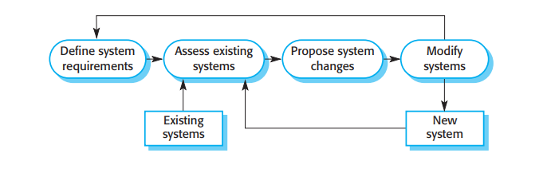

# 2.2.4 软件演化

软件的可调整性是越来越多的软件被加入大型复杂系统的原因。当决定生产硬件之后，对硬件设计的修改时十分昂贵的。但是在软件系统开发完之后依然能随时对软件进行修改。哪怕是密集的修改，软件相比于硬件的费用也便宜很多。

历史上，软件开发过程和软件演化（软件维护）的过程常常是分离的。人们认为软件开发是一个创造性活动，因为它使得软件系统从初期的概念发展成了能工作的系统。然而他们时常会将软件维护视为无聊且枯燥的活动，认为维护不够有趣，也没有原始软件开发的挑战性。

<figure><figcaption>
图2.8 软件系统演化
</figcaption></figure>

但是现在软件开发和维护的区别越来越小了。全新的软件系统寥寥可数，将开发和维护视为连续体越来越正确。与其分成两个过程，把软件工程看作一个不断演化的过程（图2.8）更为合适，软件在它的生命期内逐渐改变，面对变化的需求和客户的需要。
