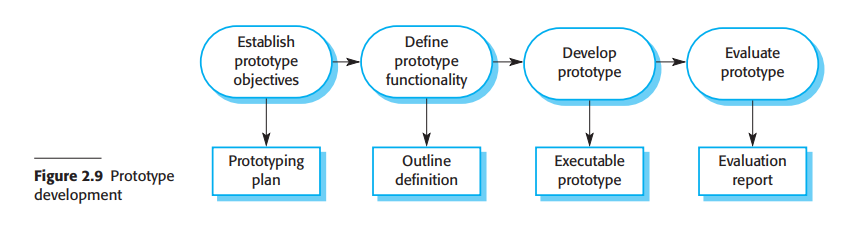

# 2.3.1 使用原型

原型（prototype）是软件系统的早期版本，用于演示概念，测试设计选项并且弄清问题以及它的解决办法。原型开发需要快速且迭代，保证预算可控且系统的参与者可以在软件过程早期试验系统。

软件系统原型可以在软件过程中用于帮助预测可能需要的修改：

1. 在需求工程中，原型可以帮助系统需求的灵感和验证。
2. 在系统设计过程中，原型可以用于探索软件解决方案和系统用户界面开发。

系统原型使得潜在用户可以看到系统能多大程度上协助他的工作。他们也许能获得新需求的想法，并且发现软件的强项和弱项。接下来他们可能会提出新的系统需求。另外，在原型开发的同时可能会揭露出系统需求的遗漏和错误。系统说明描述的特性在此时会显得清晰且有用。然而，但功能结合了其他功能时，用户经常会发现他们一开始的想法是错误或是不全面的。这时可以修改系统说明来反映关于需求理解的改变。

系统原型可以在系统设计过程中用来测试设计的可行性。比如一个数据库设计可以做出原型然后测试它是否足够支持大部分用户查询的数据存取。结合终端用户参与的高速原型开发是开发用户界面的最合理方法。因为用户界面动态的特性，文本的描述和图表并不足以表达用户接口的需求和设计。

<figure><figcaption>
图2.9 原型开发
</figcaption></figure>

原型开发的过程模型如图2.9所示。原型的目标应该从过程的开始明确。它可以是开发用户界面、开发系统来验证系统功能需求、为经理开发一个演示系统应用。一个原型常常不能满足所有目的。如果目标未被明确，管理层或最终用户可能会误解原型的功能。因此，他们可能无法从原型开发中获得预期的好处。

过程的下一个阶段是要决定要将什么加入原型系统，或者更重要的是将什么从原型系统排除。为了减少制作原型的成本并加速交付进度，你可以为原型去掉一些功能。或者是放宽非功能需求，比如响应时间和内存占用。除非原型的目的是建立一个用户界面，不然错误处理和管理可以忽视不管。程序的质量和可靠性标准可以降低。

过程的最终阶段是原型演化。在这个阶段，必须为用户培训做好准备，并应使用原型目标来制定评估计划。潜在用户需要时间来适应新系统，并且将其加入正常的工作模式。只要他们正常使用系统，就能发现需求的错误和遗漏。原型的一个常见问题是用户不会像使用最终系统一样使用原型。原型测试员可能不是典型的系统用户。可能没有足够的时间在原型演化时训练用户。如果原型运行缓慢，那么评估者可能会改变他们工作的方法来避免使用响应速度慢的特性。如果最终系统有更快的响应速度，他们可能会用另一种方式来使用系统。
