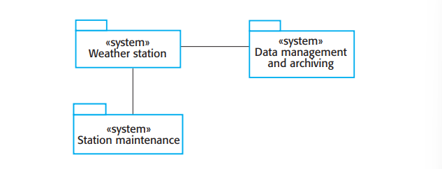

# 1.3.3 野外气象站

为了协助监视气候变化，提升偏远地区天气预报的准确度，某拥有大片荒野地区的国家决定在偏远地区部署数百个气候站。这些气候站从一系列器材中收集数据，包括温度、气压、日照、降雨、风速和风向。

<figure><figcaption>
图 1.7 气象站的环境
</figcaption></figure>

野外气象站是一个巨大系统的一部分（图 1.7），这个系统是一个气象信息系统，从气象站收集数据并将其贡享给其他系统供处理。图1.7中的系统有：

1. 气象站系统：负责收集气象数据、实行初步数据处理、转发信息至信息管理系统。
2. 信息管理与归档系统：从所有野外气象站收集数据，进行数据处理与分析、并且用其它系统能读取的格式归档存储数据，比如天气预报系统。
3. 站点维护系统：此系统可以使用卫星与所有的野外气象站通信，监视这些系统的状况并报告问题。它可以更新这些气象站中的嵌入式软件。当出现系统问题的时候，它也可以远程控制这些气象站。

在图1.7中，我使用了UML包的符号用于表示这些单独的系统都是组件的集合，每个系统的类别表示为UML默认的«system»。包之间的联系（连线）表示他们之间存在信息的交换，在这个阶段还不需要做更细节的定义。

气象站包括测量气象参数的器件，比如风速和风向、地表和空气温度、大气压、24小时内降雨。每个器件由一个周期读取参数的软件系统控制并管理相关数据。

气象站系统通过不断收集气象观测来运转。例如，温度数据每分钟测量一次。不过因为卫星的带宽相对较窄，气象站会对数据进行一些处理和聚合。这些数据在数据收集系统请求时会被直接转发过去。如果无法连接到卫星，气象站就会自己保存数据，直到通信恢复。

每个气象站必须由电池驱动、完全自给自足，不存在外部的电线或是网线。所有的通信通过一个相对低速的卫星链路实现，然后气象站必须有机械组件（太阳能或是风能）为自己供电。当它们被部署进野外后，他们会暴露到野外环境中，可能会被动物破坏。气象站的软件只与收集数据相关。它也需要：

1. 监视器件、电池和通信硬件、向管理系统报告错误。
2. 管理系统功耗，保持在任何允许的环境下电量充足，以防发电机由于危险气候原因损坏，比如强风。
3. 当软件的一部分更新了版本时，允许动态重设，或是出现系统停止时切换至备用部件。

因为气象站必须要自给自足且无人看管，这意味着它安装的软件十分复杂，即使它的数据收集功能十分简单。
