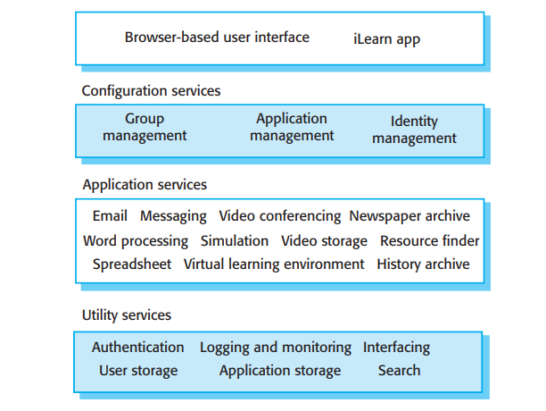

# 1.3.4 供学校使用的数字学习环境

很多老师认为使用交互式的软件系统来辅助教学可以在提高学生学习兴趣的同时还能加深学生对于知识的理解。然而对于“最佳”的计算机辅助学习策略却没有定论，实际老师们使用一系列不同的交互式的网络工具来辅助学习。工具的选择取决于学生的年龄、文化背景、对于电脑的经验、可用的设备和教师的偏好。

数字学习环境是一个框架，其中有一组适合通用目标且特殊设计过的学习工具，以及一组适合该系统的学习者需求的应用程序。框架提供了一般的服务包括认证服务、同步和异步通信服务、以及存储服务。

每个环境版本中包含的工具由老师和学生选择来适配自己的需求。这里也许有普通的应用包括电子表格、学习管理应用：管理作业和权限的虚拟学习环境（Virtual Learning Environment, VLE）、游戏、模拟软件。也许会有不同的内容，比如美国南北战争；和配套解释和查看内容的应用。

图1.8是一个数字学习环境（iLearn）的高级层次结构模型，为三岁到十八岁的在校学生设计。这里采用的解决方案是分布式系统，环境的所有组件是可以在网络上随意访问的服务。每个学习工具不需要聚集在一个位置。

<figure><figcaption>
图1.8 数字学习环境（iLearn）的体系结构
</figcaption></figure>

系统是一个面向服务的系统，所有的组件都是可以更换的。系统内有三种服务：

1. 实用服务：提供基本的应用独立功能，供系统其他服务使用。实用服务常常是为系统专门开发或者改造的。
2. 应用服务：提供专用的应用，比如邮件、会议、照片分享、以及访问特定的教育内容：科学电影或是历史资源。应用服务是外部服务，可能需要付费购买或是通过互联网免费使用。
3. 设置服务：用于修改环境使用的服务组，定义服务在学生、教师、家长的分享方式。

这个环境被设计为每个服务都可以被替换成新的服务，也可以根据不同年龄的用户开发很多版本的系统。这意味着系统需要支持两个级别的服务集成：

1. 集成服务：提供应用编程接口（application programming interface, API），别的服务通过这些API访问它们。所以可以通过它们实现直接的服务间通信。集成服务的一个例子是认证服务。别的服务可能会使用专用的认证服务而不是自己的认证机制来认证用户。如果用户已经被认证，认证服务可以直接将认证信息通过API发送给别的服务，用户无需重复认证。
2. 独立服务：仅仅由网络访问，与其他服务独立运行。只能通过用户的显式操作（如复制粘贴）与其他服务分享信息。独立服务可能需要重新认证。

如果一个独立服务被广泛使用，开发团队可能会将其转为集成受支持的服务。
