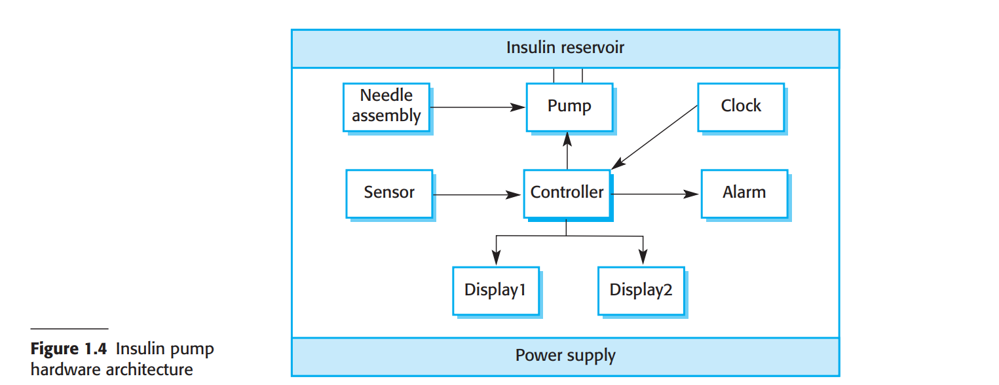
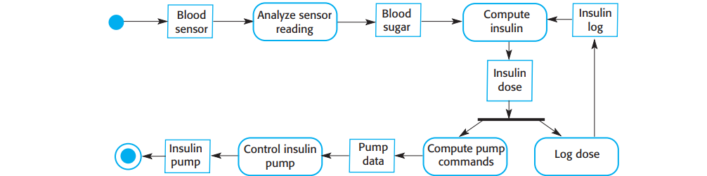

# 1.3.1 胰岛素泵控制系统

胰岛素泵是一种模拟胰腺（一种内部器官）活动的医疗系统。这个系统的软件控制系统是一个嵌入式系统，它从传感器收集信息并且控制泵来为用户定量注入胰岛素。

患有糖尿病的人会使用这种系统。糖尿病是一种相对常见的疾病，患者的胰腺不能产生足够的胰岛素。胰岛素会代谢血液中的葡萄糖。糖尿病的保守治疗包括规律性地注射基因改造过的胰岛素。糖尿病患者需要周期使用外部仪表测量自己的血糖水平，估计需要注射的胰岛素用量。

问题在于需要的胰岛素量不只是取决于血液葡萄糖水平，也取决于距离上次注射胰岛素时间长短。不规律的检查可能会导致血糖过低（胰岛素过多），或者是血糖过高（胰岛素过少）。短期来看低血糖更为危险，它可能会导致暂时性脑功能失调，极端情况会导致休克死亡。长期来看，持续的高血糖会导致眼部受损，肾脏受损，以及心脏病。

<figure><figcaption>
图 1.4 胰岛素泵硬件结构
</figcaption></figure>

<figure><figcaption>
图 1.5 胰岛素泵的行为模型
</figcaption></figure>

小型传感器技术的进步意味着现在可以开发自动的胰岛素注射系统。这些系统监视血糖水平并且在需要时注入适量的胰岛素。类似图中的胰岛素注射系统现已可用，难以自己控制血糖水平的患者会使用这种系统。未来，糖尿病患者可能会有类似的设备永久连接至身体辅助治疗。

软件控制的胰岛素注射系统使用一个嵌入至患者身体的微型传感器，用于测量一些与血糖水平成正比的血液指标。这些数据随即被送到泵控制器。控制器使用数据计算血糖水平和需要的胰岛素用量。然后给微型泵发送信号，通过一个永久连接的针头注入胰岛素。

图1.4展示了胰岛素泵的硬件组件及其组合方式。为了理解本书的例子，你需要知道的仅有：血液传感器（blood sensor）测量血液在不同条件下的导电率，这些值与血糖水平相关。胰岛素泵（insulin pump）每接受一个来自控制器（controller）的脉冲就注射一个单位的胰岛素。所以，需要注射10个单位的胰岛素的时候，控制器需要发送10个脉冲。图1.5是一个统一建模语言（Unified Modeling Language，UML）活动模型，它描绘了输入的血糖数据如何通过软件转化为驱动胰岛素泵的指令序列。

显然，这是一个安全关键型系统。如果泵停止运转或是没有正确运转，用户的健康会遭到损害，或者因为血糖过低/过高导致休克。因此这个系统必须满足两个高级必要需求：

1. 系统需要在任何需要注射胰岛素时可用。
2. 系统需要可靠运行，针对血糖水平总能注入正确用量的胰岛素。

系统必须设计并实现这些需求。更细节的保证系统安全需求和讨论会在后面章节给出。
