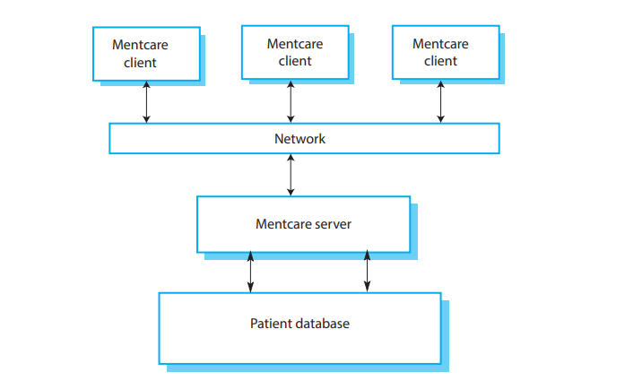

# 1.3.2 心理健康患者信息系统

心理健康患者信息系统（心理健康医疗系统）是用于维护有心理疾病患者的患病信息和他们所受治疗内容的医疗信息系统。大多数的心理健康患者并不需要专业的医院治疗，而是需要定期去专业诊所，那里有熟知他们病情的医生。为了让患者更容易就诊，这些诊所可能不只在医院内经营；也可能在当地的医疗机构或者是社区中心内。

<figure><figcaption>
图 1.6 心理健康医疗系统的组织结构
</figcaption></figure>

心理健康医疗系统（图1.6）是在诊所内使用的患者信息系统。它采用了一个中央数据库存储患者信息，但是也设计在笔记本上可用，所以它可以从没有安全网络连接的站点上访问并使用。当本地系统有安全网络连接时，他可以使用数据库中的患者信息，在没有安全连接时，使用本地的患者记录备份。此系统不是一个完全的医疗信息记录系统，不维护其他医疗条件的信息。不过它可以和其他临床信息系统交互并交换信息。

这个系统有两个目标：

1. 生成管理信息，使卫生服务经理能够根据当地和政府目标评估绩效
2. 为医疗人员提供及时的治疗辅助信息，加强对患者的治疗。

有心理健康问题的患者可能有时会有不理智或是混乱的状态，导致错过预约、有意或是无意丢失处方和药品、忘记医嘱或是对医疗人员做出不合理要求。他们可能会突然来到诊所。在少数情况，他们会对自己或别人造成威胁。他们可能经常性改变住址或是变成无家可归一段时间。在患者变得危险时，他们需要被管制：限制在安全的医院内进行治疗和观察。

系统的用户包括临床员工例如医生、护士、医疗探访人员（去家中探访病人检查治疗情况的护士）。非医疗用户包括负责预约的接待员、维护记录系统的医疗记录员工、负责报告的管理员工。

系统用于记录患者的信息（名字、住址、年龄、直系亲属等）、就诊信息（日期、接诊医生、患者表现等），指标和治疗情况。报告是由医疗人员和卫生当局管理人员定期书写。通常医疗人员的报告关注每个患者的信息，管理报告是匿名的，内容与环境条件和治疗费用等相关。

系统的核心特性是：

1. 个人护理管理：临床医生可以为患者创建记录、修改系统内信息、查看患者病历等。系统支持数据摘要，医生没有见到患者就可以了解患者已经在处方上的关键问题和治疗记录。
2. 患者监控：系统周期监控治疗中患者的记录，如果检测到可能存在问题就发出警报。因此，如果一个患者一段时间没有找医生就诊，系统可能会发出警告。这种监控系统的一个关键是保持记录管制中患者的状态，确保及时依法检查。
3. 管理报告：系统生成每月的管理报告，包括在每个诊所就诊的患者数，进入和离开系统的患者数，管制患者的数量，开出药品的数量和花费。

有两个不同的法律影响这个系统：管理个人信息安全的数据保护法以及管理对自己或他人可能造成威胁的患者的强制检查法律。心理健康在此受特别对待，是唯一一个可以违背患者意愿进行治疗的医疗专业。这受到严格的立法保护。心理健康医疗系统的一个目标是确保员工永远按照法规要求工作，并记录他们的操作以备可能的法律审查。

在所有的医疗系统中，隐私都是一个关键的系统需求。患者的信息必须保持机密并且永远不能泄露给授权的医疗人员和患者自己以外的人。心理健康医疗系统也是一个安全关键型系统。某些心理疾病会使得患者自杀或是威胁他人。在任何可能的场景，系统都必须将潜在的自杀或是危险患者通知给医疗人员。

系统的总体设计需要考虑到隐私和安全需求。系统必须在需求时可用，否则就会在安全性上让步，无法为患者开出正确的药品。这里存在一个可能的冲突。如果系统数据只有一份，那么很容易保护隐私安全。然而为了确保在服务器宕机或是网络中断的时候依然可用，数据需要多份备份。我会在后几章中讨论这些需求的取舍。
